author: Marc DiPasquale
summary: Be Event-Driven with AsyncAPI & Spring Cloud Stream
id: workshop-scs-s1p
categories: Spring,SpringCloudStreams,Java,PWS
environments: Web
status: published
feedback link: github.com/Mrc0113/workshop-scs-s1p
analytics account: UA-49880327-14

# Developer Workshop: Be Event-Driven with AsyncAPI & Spring Cloud Stream 

## CodeLab Overview
Duration: 0:05:00

In this workshop we will use Java & Spring Cloud Stream (SCS) to create Event-Driven Applications with PubSub+ in PWS.
After creating a few by hand we will see how the AsyncAPI specification can be used to define your event-driven microservices and even generate a microservice! 
* The purpose of this codelab is to introduce java developers to creating event-driven applications with Spring Cloud Stream and PubSub+ in Pivotal Web Services.
* “Spring Cloud Stream is a framework for building highly scalable event-driven microservices connected with shared messaging systems."
* It is based on Spring Boot, Spring Cloud, Spring Integration and Spring Messaging

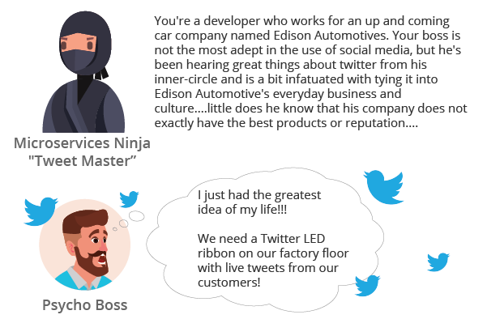

Positive
: **Developer Resources** 
Spring Cloud Stream Project Home: [https://spring.io/projects/spring-cloud-stream](https://spring.io/projects/spring-cloud-stream) 
The Spring Cloud Stream Reference Guide can be found [here](https://cloud.spring.io/spring-cloud-stream/spring-cloud-stream.html#spring-cloud-stream-overview-introducing).

Negative
: The SCS framework allows for building messaging-driven applications without having to explicitly write any code for publishing or receiving events.  While many microservices-oriented applications today are based on synchronous, request/response interactions based on protocols such as HTTP or gRPC, the asynchronous, event-driven nature of communications using SCS allows for building highly scalable, efficient and responsive distributed systems that can run on-premise or in the cloud.  When combined with the high-performance Solace PubSub+ Event Broker which can be deployed in virtually any environment, you can create powerful and flexible applications that support both hybrid and multi-cloud capabilities, all operating in real-time with high throughput and low latency. 

## Set-up & Prerequisites
Duration: 0:10:00

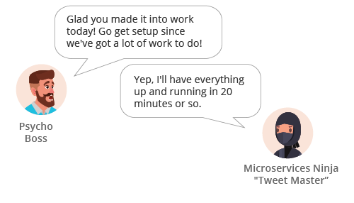

### Developer IDE & Code Access
#### IDE Setup
The recommended IDE for the workshop is Spring Tools Suite (STS) [Download Here](https://spring.io/tools). STS comes with some niceties, such as autodeploy, when used with spring-boot-devtools. Participants can of course use another IDE if preferred. It is also recommended that you begin the workshop with an empty STS workspace to avoid any unforeseen issues with existing projects/configurations/code.  

Required libraries: 
* Maven 3.5.3 or higher (ensure it's on your PATH) [Install steps here](https://maven.apache.org/install.html)
* Use the latest JDK 1.8 (ensure your PATH & JAVA_HOME are updated as needed)
* If using STS/Eclipse ensure your JDK 1.8 is thei default "Installed JRE" by choosing "Windows" -> "Preferences" -> "Java" -> "Installed JREs"
* If the correct JDK does not already have a checkmark next to it then click the "Add" button, choose "Standard VM", click "Next", navigate to your JDK -> Click "Finish". Then click the checkbox next to the added JRE and click "Apply and close"  

#### Code Access
* Clone the github repo

* Use https
``` go
$ git clone https://github.com/Mrc0113/workshop-scs-s1p.git
```
* OR Use SSH
``` go
$ git clone git@github.com:Mrc0113/workshop-scs-s1p.git
```
* OR Navigate to `https://github.com/Mrc0113/workshop-scs-s1p`, click "Clone or download" -> "Download ZIP" & unzip in your desired directory 


* Import the projects into STS
In STS, use the File -> Import -> Maven -> Existing Maven Projects -> Click Next -> Click Browse and Navigate to the git repo you cloned in the previous step -> Select all the pom files and click Finish. 

After importing everything you should see the following projects in STS: 
* 01-scs-workshop-common
* 02-scs-source-tweets
* 03-scs-sink-analytics
* 04-scs-sink-tweetboard
* 05-scs-processor-feature
* 06-scs-processor-dynamicfeature
* 07-scs-sink-bossideas
* 09-scs-processor-positive
* 10-spring-boot-mqttwebapp

Negative
: Note:  There may be errors associated with the template projects as they are incomplete and will be addressed in the exercises that follow.

###
* The workshop uses a common data model which contains the Tweet object which is processed by the SCS services. You will need to prepare the shared artifact for use across the projects. 
* Throughout this workshop we have two options when deploying apps: 
  - 1) via the *Spring Tool Suite IDE* or 
  - 2) via *maven* (mvn) on the command line. 
* If you prefer option 1 then in the *01-scs-workshop-common* project, run a Maven install to install the library to your local maven repository. 
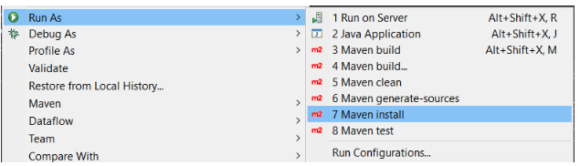

* If you prefer option 2 then navigate to the 01-scs-workshop-common directory and perform a maven install of the project.

``` 
$ cd ~/git/solace-workshop-scs/01-scs-workshop-common/
$ mvn clean install
```

### Create and/or Verify access to a Solace PubSub+ Service

#### PubSub+ Service in Solace Cloud
If you want to stand up your Solace PubSub+ Service in Solace Cloud go ahead and login or signup at the [Cloud Signup Page](https://console.solace.cloud/login/new-account).  Note that a free tier is available and will work for this workshop. **THIS IS THE PREFERRED OPTION FOR THIS WORKSHOP**

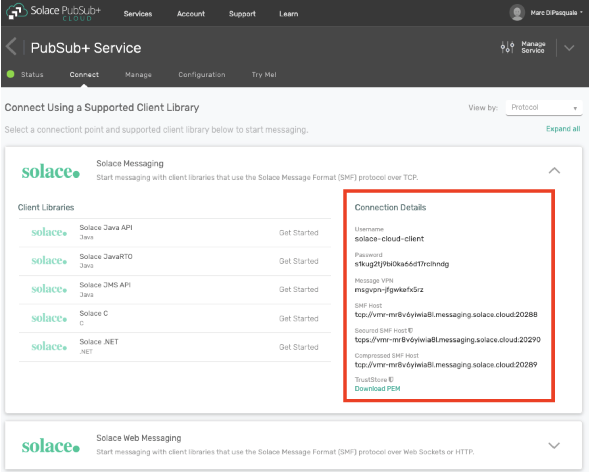

#### Local Solace PubSub+ Instance
When developing your application, you may want to test using a local instance of the Solace PubSub+ Event Broker.  Refer to the Solace [Docker Getting Started Guide](https://solace.com/software/getting-started/) to get you up and running quickly with a broker instance running in Docker. **IF CHOOSING THIS OPTION YOU WILL HAVE TO RUN YOUR APPS LOCALLY TO USE THE LOCAL BROKER**

## Deploy Your First Source & Sink
Duration: 0:30:00

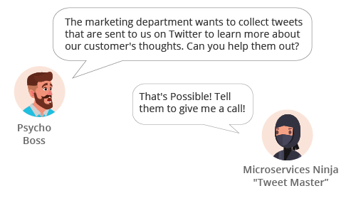

### Application Architecture
At the end of this section we will have created the apps below!
The Source will send out tweets that will be received by the marketing Sink. 

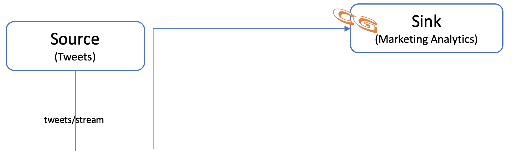

Negative
: SCS Provides 3 Binding Interfaces:
1: Sink - "Identifies the contract for the message consumer by providing the destination from which the message is consumed."
2: Source - "Identifies the contract for the message producer by providing the destination to which the produced message is sent."
3: Processor - "Encapsulates both the sink and the source contracts by exposing two destinations that allow consumption and production of messages."

### Deploying a Source

Before our company can do anything with the tweets we have to start to receive an incoming stream of them!  Let's get started! Please navigate to the "02-scs-source-tweets" project in your IDE.

#### Learn the Project Structure
Before we take a look at the code, let's take a quick look at the structure of a Spring Cloud Streams project.  

* As a java developer you'll probably see a familiar project setup. You have your main application under src/main/java and unit tests under src/test/java.

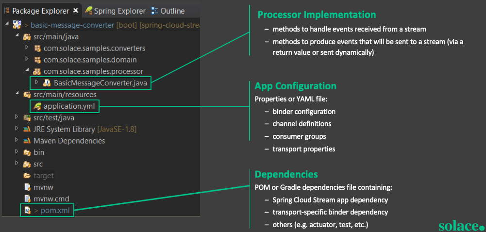

Negative
: Spring Cloud Streams is built on top of Spring Boot. A great resource for creating your own Spring Boot applications is Spring Initializr. A publically hosted version is hosted here: [start.spring.io](https://start.spring.io)

### 
* Next go ahead and open up the pom.xml file in your "02-scs-source-tweets" project and search for "binder"; you should have a dependency for either "spring-cloud-starter-stream-solace" or "spring-cloud-stream-binder-solace" which is what is going to allow SCS to connect to Solace PubSub+. "spring-cloud-starter-stream-solace" includes the "spring-cloud-stream-binder-solace" dependency which is why you could have either one. It is recommended to start with the starter.
* Note that the "spring-cloud-stream-reactive" dependency is only required for reactive streams support, but we will also discuss the use of "Spring Cloud Function" as an alternative in a later section.

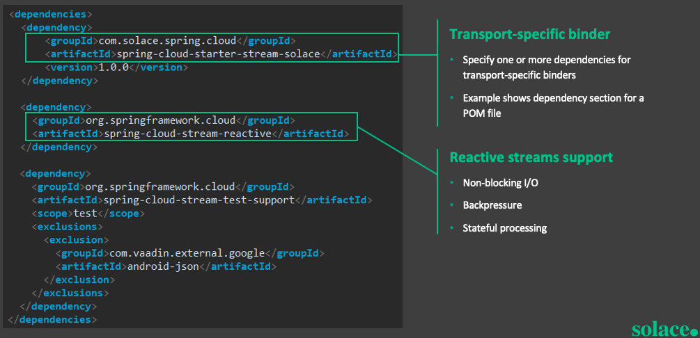

* Let's take a look at a simple sample implementation in the image below. You can see that the enrichLogMessage method is associated with both an INPUT and OUTPUT channel. In a future section we will create an application following a similar pattern, but notice that if you look at the *ScsSourceTweets.java* class in your "02-scs-source-tweets" project you will see something a bit different. We are using an *@InboundChannelAdapter* annotation in order to create our fake tweets at a fixed rate. 

Negative
: "Spring Cloud Stream is built on the concepts and patterns defined by Enterprise Integration Patterns and relies in its internal implementation on an already established and popular implementation of Enterprise Integration Patterns within the Spring portfolio of projects: Spring Integration framework." By using Spring Integration we can make use of familiar annotations such as *@InboundChannelAdapater, @Transformer or @ServiceActivator*

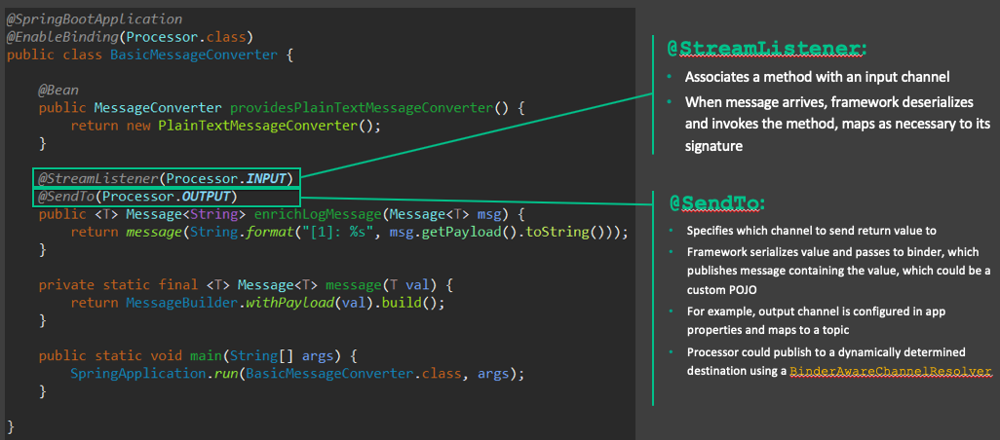

* One last thing to look at and then we'll deploy your first source! Go ahead and open your application.yml file. This file holds the bindings that tells the SCS binder how to connect your input/output channels to the specified middleware at runtime.  

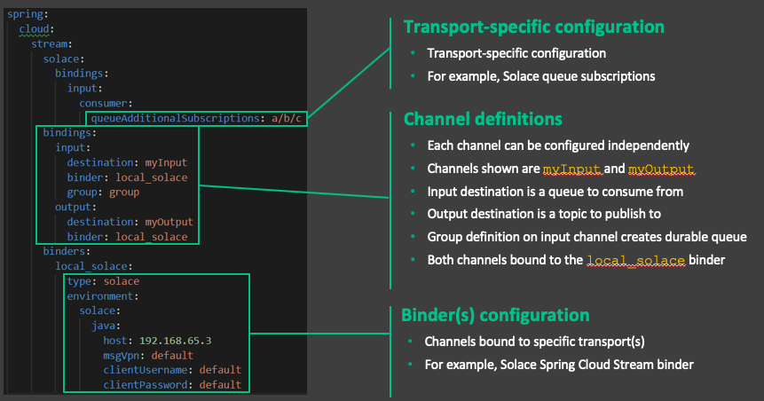

Positive
: SCS apps are not restricted to only using one binder at a time. This allows a SCS app the flexibility of receiving events from one binder/location/environment/etc, performing business logic and then sending new events to another binder/location/environment/etc. 
Also note that because bindings are dynamically configured at run-time you don't have to touch the code to switch out your binder of choice, environment info, etc. 

#### Deploy our 02-scs-source-tweets app
* First open the *application.yml* file and update the host, msgVpn, clientUsername & clientPassword to match your PubSub+ environment. When obtaining the connect info note that the SCS solace binder uses the Solace Java API with the SMF protocol. (Keep this connection info handy as you'll need it several more times throughout this lab!)
* If using STS, start the app by right clicking on the project and choosing "Run As" -> "Spring Boot App"
* If not using STS, open a cli and navigate to the project's directory and then run 
```
$ mvn spring-boot:run
```

* Whichever way you started the app you should see the app start, connect and begin to send tweets by looking at the console.

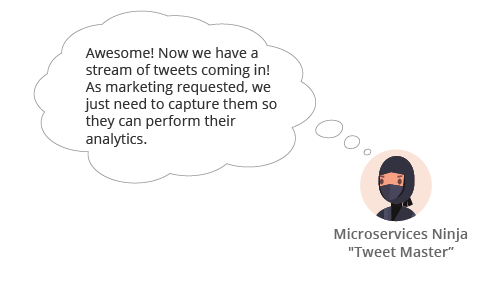

To do this we will deploy a sink app.  Recall that a sink app binds to an INPUT channel. 

### Deploying a Sink
* Open the "03-scs-sink-analytics" project 
* Take a look at the code in the *ScsSinkAnalytics.java* class; you'll notice we have a very simple class with only a few methods. As we saw earlier, the *@StreamListener* attribute identifies which channel our *sink* method will receive events from. Also notice that the sink method is expecting a POJO tweet parameter of type *Tweet*
* Now update the *application.yml* file for the "03-scs-sink-analytics" project with the same info that you used when deploying the source app, including the PubSub+ service info.
* While updating this file also replace the `<ATTENDEE_NAME>` group with your username
* Time to deploy!  Deploy the "03-scs-sink-analytics" app the same way you started "02-scs-source-tweets"
* Now that your sink is started you should see it logging the tweets as they come in! 

Negative
: Note that Spring Cloud Streams [provides message converters](https://docs.spring.io/spring-cloud-stream/docs/current/reference/htmlsingle/#_provided_messageconverters) which enable the conversion of a payload to/from a specified format/shape (such as a Tweet POJO in our case) based on the argumentType in the method signature and the contentType specified on the message. The default content type is application/json.

### 
* Developer - Woohoo! We've deployed our first SCS source and sink applications and the marketing department is now getting the stream of tweets as they requested! Time to give our boss the good news.
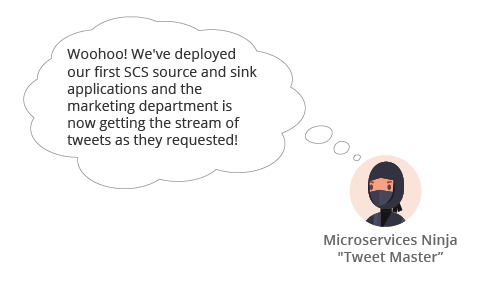

Positive
: You now have a source application sending events to a sink application via an external eventing system, but notice that you didn't need to use any messaging APIs! SCS provides this abstraction and makes it possible for developers to concentrate on their business logic rather than learning proprietary messaging APIs!

## Deploy to Pivotal Web Services
Duration: 0:10:00

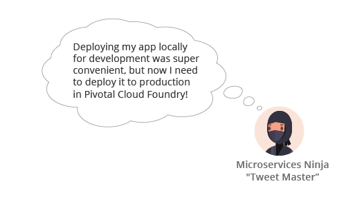

### Configure a Cloud Foundry Target in STS
STS provides integrated support for deploying, running and debugging your SCS services in PWS.  In the Boot Dashboard view, configure a connection to your PWS deployment by clicking the "+" button as seen in the image below. 

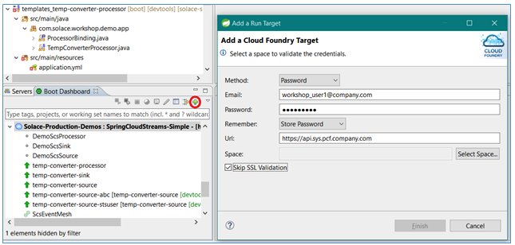

Follow the dialog prompts and fill in the username / password associated with your PWS account.  


### Cloud Foundry CLI Setup
* Install the cf-cli using these instructions: [Install CF CLI](https://docs.cloudfoundry.org/cf-cli/install-go-cli.html)
* Login to your cf org & space with your API endpoint, username/email & password. 
* Choose the proper Org & Space
``` bash
$ cf login -a <API_URL> -u <USERNAME>
$ Password> 
```

### Deploy the Source to PWS

* Open the manifest.yml file under the *02-scs-source-tweets* project
* Change `<ATTENDEE_NAME>` to your username; this is to ensure your application name is unique from other workshop attendees. 
* **If using STS** run a Maven build and install it to the local repository.
 
* Open the "Boot Dashboard" view (Window -> Show View -> Other -> Boot Dashboard)
* Right-click on your app in the Spring Boot Dashboard, and select the Deploy and Run On… -> [CHOOSE YOUR DEPLOYMENT TARGET WE SETUP EARLIER]: 

* At this point you should see the app deploying to the chosen space and the console should automatically open to follow the progress. Once complete you should see the app start to send a tweet every second. 

* **If not using STS** open a cli and navigate to the *02-scs-source-tweets* project and then run
``` 
$ mvn clean install
$ cf push
```
* At this point you should see the app being deployed to PWS. If all goes correctly you should see the app start and have a requested state of "started" before the command exits.
* You can then see the app logs by executing the command below and should see a tweet being sent every second. 
``` 
$ cf logs 02-scs-source-tweets-<ATTENDEE_NAME>
```

### Deploy the Sink to PWS
* Open the manifest.yml file under the *03-scs-sink-analytics* project
* Change `<ATTENDEE_NAME>` to your username; this is to ensure your application name is unique from other workshop attendees. 
* **If using STS** run a Maven build and install it to the local repository.


* Open the "Boot Dashboard" view (Window -> Show View -> Other -> Boot Dashboard)
* Right-click on your app in the Spring Boot Dashboard, and select the Deploy and Run On… -> [ CHOOSE OUR DEPLOYMENT TARGET WE SETUP EARLIER]:


* At this point you should see the app deploying to the chosen space and the console should automatically open to follow the progress. Once complete you should see the app start to send a tweet every second. 

* **If not using STS** open a cli and navigate to the *03-scs-sink-analytics* project and then run
``` 
$ mvn clean install
$ cf push
```

* At this point you should see the app being deployed to PWS. If all goes correctly you should see the app start and have a requested state of "started" before the command exits.
* You can then see the app logs by executing the command below and should see a tweet being sent every second. 

``` 
$ cf logs 03-scs-sink-analytics-<ATTENDEE_NAME>
```

## Discover the ease of 1-to-Many with Publish-Subscribe
Duration: 0:10:00


### Application Architecture
At the end of this section we will have added the Factory Tweet Board Sink. 

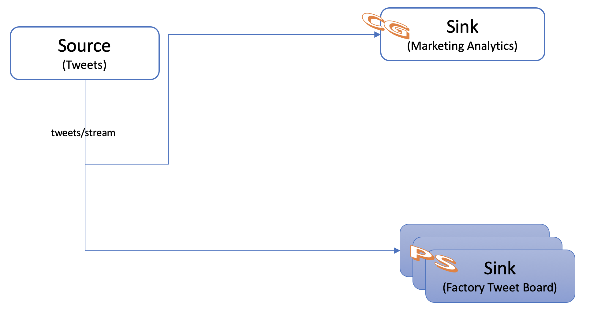

### Creating the Tweet Board Sink
We obviously don't have a giant LED board that we can use so we're going to settle for logging the tweets as they come in. 
* Open the "04-scs-sink-tweetboard" project
* Open the *ScsSinkTweetBoard.java* class
* Add the *@EnableBinding(Sink.class)* annotation to label the app as a Sink
* Add a "sink" method that takes in a "Tweet" POJO from the INPUT channel and logs that it was received. 
* Update the application.yml file, verify that there is indeed a destination configured for the input channel, replace `<ATTENDEE_NAME>` with your username (e.g: TWEETS.Q.BOARD.User1).  Note that by not specifying a group we are using the "Publish-Subscribe" messaging model. 
* You'll also need to update the host, msgVpn, clientUsername, clientPassword in the application.yml file to connect to your PubSub+ service.  
* Open the *manifest.yml* file and change `<ATTENDEE_NAME>` to your name

Negative
: Spring Cloud Streams supports multiple messaging models. We are going to use two different ones in this workshop
1: Publish-Subscribe allows for an application to process all events sent to the defined subscription. It also allows new applications to be added to the topology without disruption of the existing flow.  
2: Consumer Groups allow for a set of applications to participate in a "group" to consume messages. This option is commonly used to allow the ability for an application to scale horizontally (creating multiple instances of the same application) while only processing each event once.


### Deploying the Tweet Board
At this point we have created our "04-scs-sink-tweetboard" application and it needs to be deployed. 
* **If using STS** run a Maven build and install it to the local repository.
 
* Open the "Boot Dashboard" view (Window -> Show View -> Other -> Boot Dashboard)
* Right-click on your app in the Spring Boot Dashboard, and select the Deploy and Run On… -> [CHOOSE YOUR DEPLOYMENT TARGET WE SETUP EARLIER]: 

* At this point you should see the app deploying to the chosen space and the console should automatically open to follow the progress. Once complete you should see the app start to send a tweet every second. 

* **If not using STS** open a cli and navigate to the *04-scs-sink-tweetboard* project and then run
``` 
$ mvn clean install
$ cf push
```
* At this point you should see the app being deployed to PWS. If all goes correctly you should see the app start and have a requested state of "started" before the command exits.
* You can then see the app logs by executing the command below and should see a tweet being sent every second. 
``` 
$ cf logs 04-scs-sink-tweetboard-<ATTENDEE_NAME>
```


Positive
: Notice that the publisher (Source) application did not need to be modified in order for another consumer (Sink) application to receive the stream of tweets. There are two takeaways here: 
1: The publish-subscribe paradigm allows for the publisher to send data once and not care whether 0,1,2 or 100 applications are subscribed on the other end. It just send the data and moves on. 
2: Developing event driven applications allows for decoupling of your sending and receiving applications. This powerful concept allowed our company to add new functionality without touching our already operational applications. 

## Creating your first Processor
Duration: 0:20:00

So far in this workshop we have created source or sink applications. In this section we will create our first processor.


### Application Architecture
In order to meet our new goal we will add the Features processor and a new Sink as seen below. 

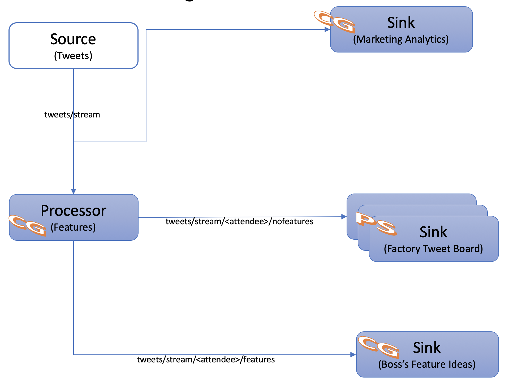

### Create the Feature Processor


#### Processor with a Custom Binding Interface	
* Open the "05-scs-processor-feature" project
* Note that we have the same project setup as the source and sink apps from the previous section and the pom file doesn't have any extra dependencies to create a Processor. 
* Now open the *ScsProcessorFeatures.java* class.
* Note that our *@EnableBinding* Annotation is specifying the *ProcessorOneInTwoOutBinding* class; this is because we have specified a custom interface to have 2 output channels (one for tweets with features, and one for all other tweets)

Positive
: Custom binding interfaces can be defined in order for your SCS app to have additional input or output channels. They also allow for custom naming of channels. 

### 
* Note that in the application.yml file the bindings that are listed include input, outputFeature, and outputNoFeature as defined in our custom bindings interface. 
* Update the `<ATTENDEE_NAME>` to be your name each time it occurs in the application.yaml file.  
* Update the host, msgVpn, clientUsername, clientPassword in the application.yml file so we can connect to the PubSub+ service
* Deploy the app in the same manner that you've been deploying the others. (Don't forget to update the `<ATTENDEE_NAME>` in the manifest.yml file!)

#### Processor using Dynamic Destinations
Negative
: At this point you might be thinking "Okay these custom binding interfaces are great, but what if I don't know how many or what to call my output channels at design time?" Spring Cloud Streams supports the use of Dynamic Destinations for this exact situation!  Dynamic destinations allow you to use business logic to define your destinations at runtime. 

### 

* Let's create a second feature processor that makes use of dynamic destinations. 
* Open the "06-scs-processor-dynamicfeature" project
* Open the *ScsProcessorFeaturesDynamic.java* class
* You'll notice that the *@EnableBinding* annotation defines the app as a "Sink" app. This is because we only bind the INPUT channel at startup and then at runtime we are using a *BinderAwareChannelResolver* (which is registered automatically by the *@EnableBinding* annotation) to dynamically create output channels. 
* Update the *topicStart* variable to replace `<ATTENDEE_NAME>` with your username

Negative
: From the JavaDocs, the *BinderAwareChannelResolver* is "A DestinationResolver implementation that resolves the channel from the bean factory and, if not present, creates a new channel and adds it to the factory after binding it to the binder."

###
* Review the *handle* method to see an example of how to specify dynamic destinations
* Open the application.yml file and change `<ATTENDEE_NAME>` to your username & add your PubSub+ connection details
* Open the manifest.yml file to replace `<ATTENDEE_NAME>` with your username. 
* Build (mvn clean install) & Deploy the app to PWS

### Create the Feature Sink for the Boss
* Open the "07-scs-sink-bossideas" project
* Open the *ScsSinkBossideas.java* class
* Add the *@EnableBinding(Sink.class)* annotation to label the app as a Sink
* Add a "sink" method that takes in a "Tweet" POJO from the INPUT channel and logs that it was received. 
* Update the application.yml file and verify that there is indeed a destination & group configured for the input channel. Note that by specifying a group we are now using the consumer group model. Since this application will likely do further processing in the future we want to provide the option of scaling up to keep up with the number of events that come in. Replace `<ATTENDEE_NAME>` with your username in BOTH spots
* While edding the application.yml fie be sure to also update your PubSub+ connection details
* At this point we have created our "07-scs-sink-bossideas" application and it needs to be deployed. Time to see if you've been paying attention! 
* Deploy the app in the same manner that you've been deploying the others. (**Don't forget to update the `<ATTENDEE_NAME>` in the manifest.yml!**)

### Update the Tweet Board Subscription
Note that our processor that we created earlier in this lab publishes to multiple topics essentially splitting our feed into two. Due to our new requirements to not show new features on the twitter board we need to update that sink appropriately.
* Navigate to your "04-scs-sink-tweetboard" project
* Open your application.yml file
* Update the queueAdditionalSubscriptions property to listen on "tweets/stream/`<ATTENDEE_NAME>`/nofeatures"
* Save the file
* Redeploy the updated App (Note if you had deployed locally it would automatically re-deploy since we're using devtools; this can also be configured to work with PWS, but is not recommended in production environments for obvious reasons)
* If deploying via STS deploy as normal by doing a Maven install on the project and then in the Boot Dashboard right clicking and choosing Deploy and Run on your target. When asked if you would like to replace content of the existing Cloud application choose "OK"
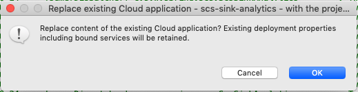
* If using the cf cli, then you also push updates the same way
``` 
$ cd /path/to/04-scs-sink-tweetboard
$ mvn install
$ cf push
```


Negative
: spring-boot-devtools is handy for development and adds features such as automatic restart and remote debugging. Click [here](https://www.baeldung.com/spring-boot-devtools) for a high level overview of some of the functionality it provides. 

Positive
: Notice that the use of topic hierarchies provides an organized way of keeping track of your event streams. This ability, combined with the ability to wildcard in PubSub+ gives your applications an easy way to subscribe to the exact event streams necessary to meet your need. Don't underestimate the value of creating a well-defined topic hierarchy! A few best practices to keep in mind are: start general and become more specific as more levels are added, use short words or abbrevations as topics can only be so long, and don't mix upper and lower case! A good topic hierarchy might be defined as "\<country\>/\<state\>/\<locality\>" which would allow you to subscribe to all events in a given country "canada/>" or even subscribe to events from all 1,716 localities named San Jose no matter what country or state they're in "\*/\*/sanjose"  

## AsyncAPI Microservice Code Gen
Duration: 0:25:00

In this section we are going to take a glimpse into the future of Event-Driven microservices by using AsyncAPI to generate a SCS Processor microservice. AsyncAPI is the industry standard for defining asynchronous APIs - more info can be found on the [specification website.](https://www.asyncapi.com/).

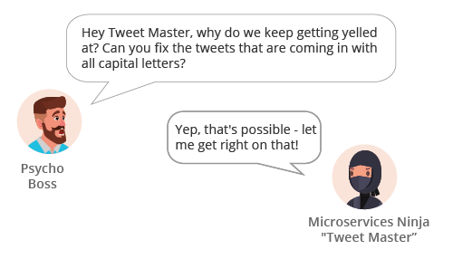

### Application Architecture
We're going to add a "No Yelling" processor in our event driven architecture in order to meet this new need.

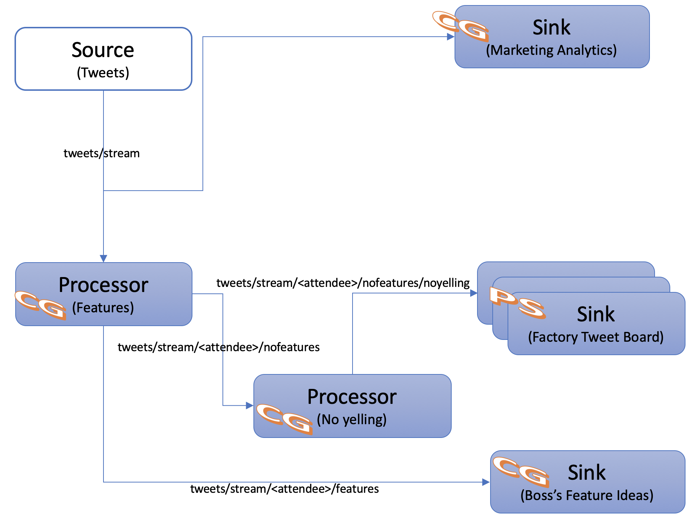


### Clone the Spring Cloud Stream AsyncAPI Code Generator 

Negative
: Note that this code generator is currently only a prototype and will be vastly improved in the near future! 

* Use https
``` go
$ git clone https://github.com/jschabowsky/AsyncAPI-Spring-Cloud-Streams-Generator.git
```
* OR Use SSH
``` go
$ git clone git@github.com:jschabowsky/AsyncAPI-Spring-Cloud-Streams-Generator.git
```
* OR Navigate to `https://github.com/jschabowsky/AsyncAPI-Spring-Cloud-Streams-Generator`, click "Clone or download" -> "Download ZIP" & unzip in your desired directory 


### Find the NoYellingProcessor AsyncAPI Specification File
This is an example AsyncAPI Specification file that defines our event-driven microservice. 
It specifies information about the application such as servers where you can interact with the microservice, channels which messages are exchanged over, and components such as the messages that are expected and the schemas which define them. 

Under the `08-yellingArtifacts` directory you should find a file called `NoYellingProcessor.yaml`
Open the file up and take a look at how the microservice is defined. 

### Generate your SCS Project Skeleton
Now that you have cloned the necessary artifacts let's go ahead and generate the project skeleton! 

* Build the Generator
```
$ cd /path/to/AsyncAPI-SpringCloudStreams-Generator
$ mvn clean install
```

* Generate the Project Skeleton
```
$ java -jar target/AsyncAPI-SpringCloudStreams-Generator-0.0.1-SNAPSHOT-spring-boot.jar --reactive --p="com.solace.spring.cloud.streams.test" --cu=solace-cloud-client --cp=default --mvpn=default /path/to/workshop-scs-s1p/08-yellingArtifacts/NoYellingProcessor.yaml
```

* Import the project into your IDE
Using the path output by the generator import the maven project into your IDE (You can skip this step if not using an IDE) 
You should see the output on the last line that was output, something like the below
`Your Project Has Been Generated at: initializr/tmp4062230108469339772`

* Update the application.yml file to use your PubSub+ service info

### Insert Business Logic using Spring Cloud Function

Positive
: Since Spring Cloud Stream v2.1, another alternative for defining stream handlers and sources is to use build-in support for Spring Cloud Function where they can be expressed as beans of type java.util.function.[Supplier/Function/Consumer]. Since Spring Cloud Function is built on top of Project Reactor it also provides the ability to use the reactive programming model when creating Spring Cloud Stream microservices. 

Negative
: Spring Cloud Function supports 3 types that conveniently map to our 3 SCS binding interfaces. 
 java.util.function.Function maps to a SCS Processor
 java.util.function.Supplier maps to a SCS Source
 java.util.function.Consumer maps to a SCS Sink

* Open the *ScsprocessoryellingApplication* class
* Update the *handleInboundTweet* method to change uppercase letters to lowercae letters in the tweet text using the reactive programming model; an example of this can be seen in the code snippet below. 
* Note that although we still have the *@EnableBinding(Processor.class)* annotation we are now binding a bean of type "java.util.function.Function" to the external destinations exposed by the bindings by providing the spring.cloud.stream.function.definition property.

``` java
package com.solace.spring.cloud.streams.test;

import java.util.function.Function;

import org.slf4j.Logger;
import org.slf4j.LoggerFactory;
import org.springframework.boot.SpringApplication;
import org.springframework.boot.autoconfigure.SpringBootApplication;
import org.springframework.cloud.stream.annotation.EnableBinding;
import org.springframework.cloud.stream.messaging.Processor;
import org.springframework.context.annotation.Bean;

import com.solace.spring.cloud.streams.test.types.Tweet;

import reactor.core.publisher.Flux;

@SpringBootApplication
@EnableBinding(Processor.class)
public class ScsprocessoryellingApplication {
	
	private static final Logger logger = LoggerFactory.getLogger(ScsprocessoryellingApplication.class);

	public static void main(String[] args) {
		// Defining the reactive function to bind to the INPUT channel of the Processor
		SpringApplication.run(ScsprocessoryellingApplication.class, "--spring.cloud.stream.function.definition=handleInboundTweet");
	}
	
	@Bean
	public Function<Flux<Tweet>, Flux<Tweet>> handleInboundTweet() {
		return flux -> flux
				.doOnNext(t ->logger.info("====Tweet BEFORE mapping: " + t.toString()))
				.map(t -> { t.setText(t.getText().toLowerCase());
					return t;
					})
				.doOnNext(t ->logger.info("++++Tweet AFTER mapping: " + t.toString()))
				;
	
	}
```

Positive
: From the Spring docs, Spring Cloud Function allows you to "Decouple the development lifecycle of business logic from any specific runtime target so that the same code can run as a web endpoint, a stream processor, or a task."  Read more here: [https://spring.io/projects/spring-cloud-function](https://spring.io/projects/spring-cloud-function)

### Deploy to PWS

At this point our microservice is ready to run, but in order to deploy to PWS we need to create a manifest.yml file at the top level of the project. 
Create a `manifest.yml` file with the contents below - make sure to change `<ATTENDEE_NAME>` to your username. 

```
---
applications:
- name: scsprocessoryelling-<ATTENDEE_NAME>
  memory: 1024M
  path: target/scsprocessoryelling-0.0.1-SNAPSHOT.jar
```

At this point we have created our no yelling microservice and it needs to be deployed. 
* **If using STS** run a Maven build and install it to the local repository.
 
* Open the "Boot Dashboard" view (Window -> Show View -> Other -> Boot Dashboard)
* Right-click on your app in the Spring Boot Dashboard, and select the Deploy and Run On… -> [CHOOSE YOUR DEPLOYMENT TARGET WE SETUP EARLIER]: 

* At this point you should see the app deploying to the chosen space and the console should automatically open to follow the progress. Once complete you should see the app start to send a tweet every second. 

* **If not using STS** open a cli and navigate to the scsprocessoryelling-*ATTENDEE_NAME* project and then run
``` 
$ mvn clean install
$ cf push
```
* At this point you should see the app being deployed to PWS. If all goes correctly you should see the app start and have a requested state of "started" before the command exits.
* You can then see the app logs by executing the command below and should see a tweet being sent every second. 
``` 
$ cf logs scsprocessoryelling-<ATTENDEE_NAME>
```

Pretty cool huh? With AsyncAPI & the Spring Cloud Stream generator all you had to do was enter your business logic and your event-driven microservice was ready to go! 

## Multiple Processor Chaining
Duration: 0:10:00


Negative
: Obviously this company has some morality issues :) 
In the real world you should definitely not modify people's speech or create fake news!  

### Application Architecture
A processor will be added to our architecture in order to convert negative words to positive ones.

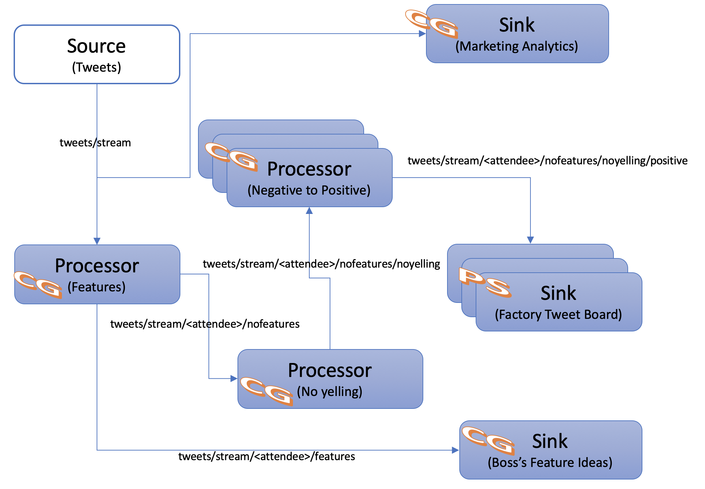

### Create the Processor
Let's get started and hopefully have a bit of fun! 
* Open the "09-scs-processor-positive" project
* Open the manifest.yml file and change `<ATTENDEE_NAME>` to your name 
* Don't forget to update the solace service in the manifest.yml file to point to your PubSub+ service!
* Open the application.yml file and change **all 3** `<ATTENDEE_NAME>` placeholders with your name (in the input group, output destination & queueAdditionalSubscriptions)
* Find & Open the *ScsProcessorPositive.java* class. At this point we know how to create and deploy a processor so we'll do something a bit different. At the top of the class you'll see that the negToPosMap object is being initialized in a static method. This Map holds the key for changing our negative tweets to positive ones. Go ahead and fill in some positive words for each negative one in the map. Remember that you can find the canned tweets in the canned_tweets.txt file under the "02-scs-source-tweets" project if you need some more context :) 
* After filling in your "positive" words go ahead and deploy the app

Positive
: Notice that multiple processors can easily be connected together in order to form a processing chain. 

### Update the Tweet Board Subscription
* Navigate to your "04-scs-sink-tweetboard" project
* Open your application.yml file
* Update the queueAdditionalSubscriptions property to listen on "tweets/stream/`<ATTENDEE_NAME>`/nofeatures/noyelling/positive" replacing `<ATTENDEE_NAME>` with your name
* Save the file
* Redeploy the updated App (Note if you had deployed locally it would automatically re-deploy since we're using devtools; this can also be configured to work with PWS, but is not recommended in production environments for obvious reasons)
* If deploying via STS deploy as normal by doing a Maven install on the project and then in the Boot Dashboard right clicking and choosing Deploy and Run on your target. When asked if you would like to replace content of the existing Cloud application choose "OK"

* If using the cf cli, then you also push updates the same way
``` 
$ cd /path/to/app
$ mvn install
$ cf push
```

Negative
: Note that a *cf restage* would rebuild with the same code, but would pickup changes to library dependencies or the buildpack itself and a *cf restart* will just restart the already built droplet

## Painless Multi-protocol with MQTT
Duration: 0:10:00


### Application Architecture
To meet this new requirement we are going to add the MQTT Web App shown in the diagram below:

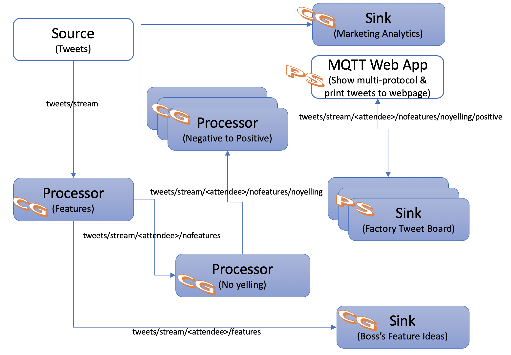

Positive
: Since we're using Solace PubSub+ as our event broker we support a bunch of open standards and protocols. Even though the SCS apps are sending/receiving events using the Java API other applications can still use their language/protocol of choice. 

### Obtain PubSub+ Credentials for an App that can't use the Cloud Connector & Auto-config
#### IF PARTICIPATING IN AN INSTRUCTOR LED WORKSHOP THE INSTRUCTOR WILL PERFORM THIS SECTION. YOU ARE WELCOME TO RUN LOCALLY IF YOU WOULD LIKE
* Open Pivotal Apps Manager & Login
* Navigate to your Org & Space
* Click on "Services"
* Choose your "Solace PubSub+" service instance
* Click "Create Service Key" (in red box below)
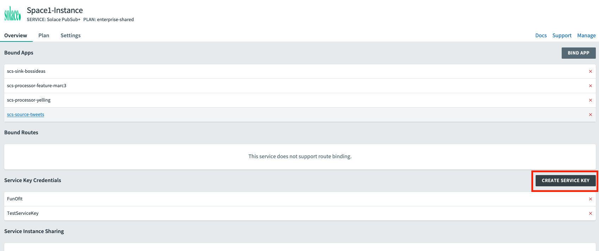
* Type in a Credentials key name, such as "DemoServiceKey" & Click "Create"
* After it's created, click on your Service Key Credentials & find and record the "publicMqttWsUris", "clientUsername" & "clientPassword" as we'll need them in the next step
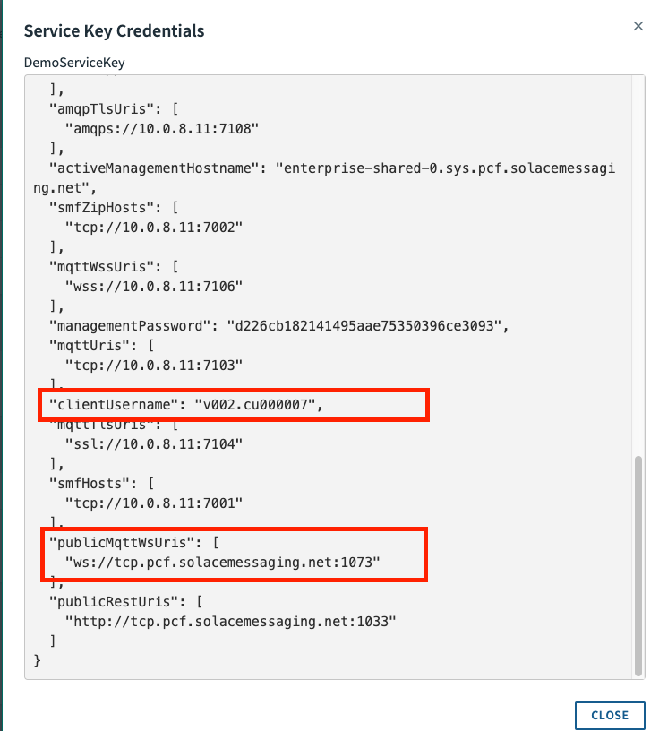

### Create the Web App
#### IF PARTICIPATING IN AN INSTRUCTOR LED WORKSHOP THE INSTRUCTOR WILL PERFORM THIS SECTION. YOU ARE WELCOME TO RUN LOCALLY IF YOU WOULD LIKE
* Since we're Spring experts let's go ahead and whip up a quick Spring Boot app that uses JavaScript and the open source MQTT Paho library to connect to PubSub+ and receive the stream of tweets.  
* Open the "10-spring-boot-mqttwebapp" project
* Check out the *pom.xml* file and notice that there is nothing spring-cloud-streams related; only spring boot! 
* Then open up the *mqttListener.html* to see how simple it was to connect & receive events using MQTT Paho. 
* In *mqttListener.html* update the host/port/username/credentials to connect to PubSub+ (Search for "UPDATE" to find where the updates need to be made) using the information found in the previous subsection.
* Lastly look at the *MqttWebApp.java* class.  You'll see that we just have a simple RestController that is smart enough to make the files in src/main/resources/static available for HTTP access.
* Now that we've taken a look at how the app works go ahead and deploy it. 
* Once deployed navigate to *http://**LOOKUP YOUR ROUTE**/mqttListener.html* to see the incoming tweets! You can lookup your route in the apps manager or by using the command below:

``` 
$ cf app 10-spring-boot-mqttwebapp
```

Negative
: Note that the MqttWebApp is actually running locally in your browser. This paradigm of creating credentials in the PubSub+ service can be used to connect other external apps as well!

## Review & Continued Learning!
Duration: 0:00:00

### Review

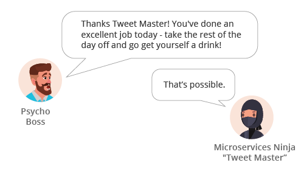

Positive
: Hopefully you not only learned how to use Spring Cloud Streams today, but also how it enables developers to concentrate on achieving business goals by removing the need to learn messaging APIs. You should also now have a solid understanding of how implementing an event-driven architecture allows for loose coupling between your apps which enables rapid addition of new functionality. 

### Continued learning topics: 

This course was just an introduction to Spring Cloud Streams, but we've included some resources below if you're interested in learning more about it or some of the features that complement it! Happy Learning :) 

* [Error Handling](https://docs.spring.io/spring-cloud-stream/docs/current/reference/htmlsingle/#spring-cloud-stream-overview-error-handling)
* [Content Based Routing](https://docs.spring.io/spring-cloud-stream/docs/current/reference/htmlsingle/#_using_streamlistener_for_content_based_routing)
* [Functional Composition with Spring Cloud Function](http://cloud.spring.io/spring-cloud-stream/spring-cloud-stream.html#_functional_composition)
* [Content Type Negotiation](https://docs.spring.io/spring-cloud-stream/docs/current/reference/htmlsingle/#content-type-management)
* [Actuator for metrics](https://docs.spring.io/spring-cloud-stream/docs/current/reference/htmlsingle/#spring-cloud-stream-overview-metrics-emitter)
* [Sleuth for tracing](https://cloud.spring.io/spring-cloud-sleuth/single/spring-cloud-sleuth.html)
* [Join the Solace Developer Community](https://solace.community)
